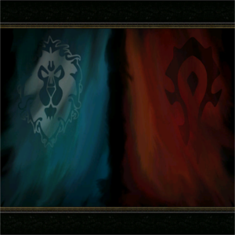
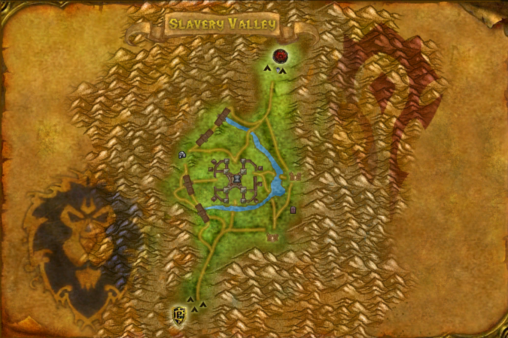
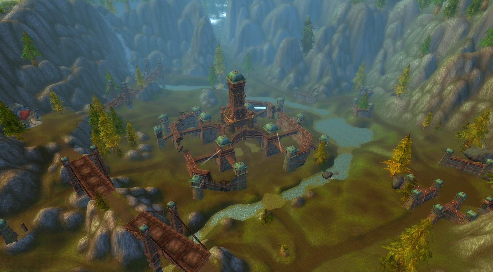
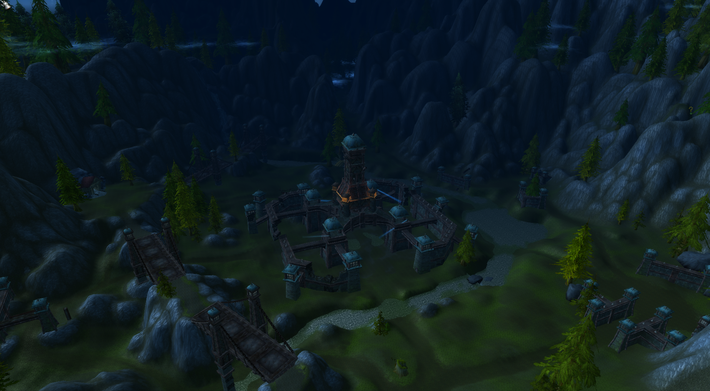
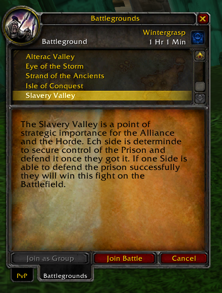
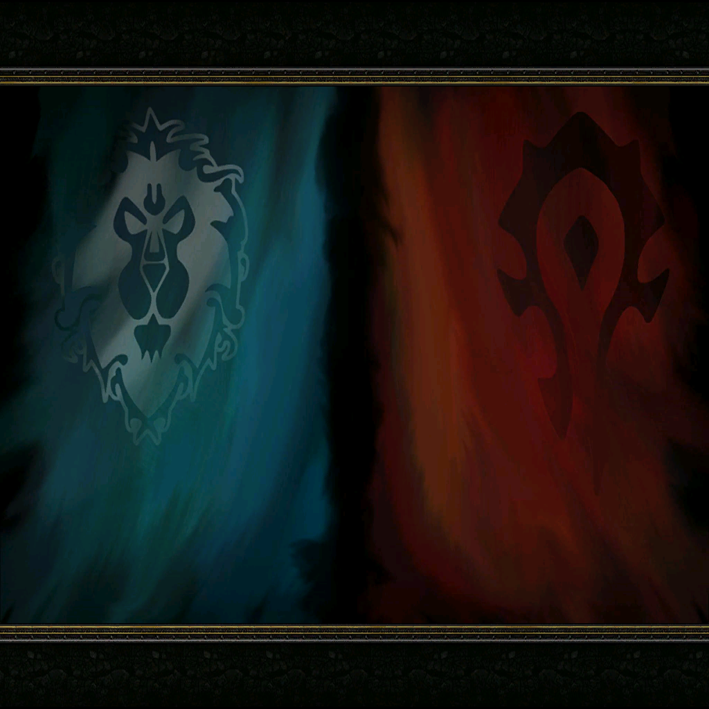
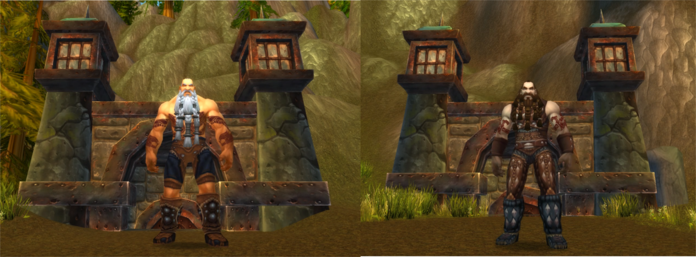

# Slavery Valley



## Description

This module add the battleground Slavery Valley.  
Put a star ⭐️ in the repo if you like it!

### How the battleground works?

- Any faction has **80 points** (as default), the goal is decrease the points of the opposite faction by killing the players or the boss.
- There are three bases: **Mine, Restless Graveyard, Prison**.
- Restless Graveyard and Mine give you the **Spirit Healer** of the base.
- **Mine**, if taken, buffs the team with **Mine Buff**, it increases your damage by 5%.
- **Restless Graveyard**, if taken, buffs the team with **Restless Soul Graveyard Buff**, it increases your stamina.
- If you **kill a player** you inflict 1 point to the opposite faction, if you **take Prison** you inflict 2 points when you kill a player.
- The base Prison has no graveyard.
- There are two bosses one for each faction.
- When you kill a boss inflict 10 points to the opposite faction, if you took all the bases, when you kill the boss you inflict 25 points to the opposite faction.
- If one of the two bosses die, the other boss disappear.
- The bosses (re)spawn after 5 minutes.







# Bosses



## Requirements

This module requires:

- AzerothCore v2 from [this revision](https://github.com/azerothcore/azerothcore-wotlk/commit/75bf44d1684048b02bc338877fb11a62647a6896)

## Installation

**Server-side**

Install the module step by step:

```
1) Simply place the module, in server-side/mod-bg-slaveryvalley, under the `modules` directory of your AzerothCore source.
2) Import the SQL manually to the right Database (auth, world or characters) or with the `db_assembler.sh` (if `include.sh` provided).
3) Re-run cmake and launch a clean build of AzerothCore.
```

The client data files (dbc, maps etc.) to load the battleground server-side are in [server-data.zip](https://github.com/Helias/mod-bg-slaveryvalley/releases/download/1.0/server-data.zip)

Downloaded the files put them in your server/data/ folder, you need to overwrite the old dbc files and just add the others.

**Client-Side**

You need to download the [patch-S.mpq](https://github.com/Helias/mod-bg-slaveryvalley/releases/download/1.0/patch-S.MPQ) and put it in your _WoW/Data/_ folder or in your _WoW/Data/enUS/_ folder, with the following name: **patch-enUS-4.MPQ**.
If you have a different client than enUS rename it with your client-lang name, for example for ruRU client put the patch in _WoW/Data/ruRU/_ and rename it as **patch-ruRU-4.MPQ**.

**The languages supported from this patch are: enUS, enGB, ruRU, frFR, deDe, esES, esMX.**

To use this patch correctly you need this wow.exe cracked version, you can take it using the following download links:

- [windows version](https://mega.nz/#!Q5QR1SjJ!Arg1O1F7Mr5U6tE9aZcH0iFndYcGBK_AmfvZTn4kUjg)
- [mac version](https://mega.nz/#!c8IQXCab!PrUfJSS0OmrFJL1GASXIKY2_tLkdUsI95SJNbelont0)

## Edit module configuration (optional)

If you need to change the module configuration, go to your server configuration folder (where your `worldserver` or `worldserver.exe` is), copy `slavery_valley.conf.dist` to `slavery_valley.conf` and edit that new file.

## TODO

- Fix the config system

## Credits

- [Snoopzz](http://www.modcraft.io/index.php?topic=10882.0)
- [Helias](https://github.com/Helias)
- [Knindza](https://github.com/Knindzagxg)
- [Root#1633](https://github.com/cristian-root)

AzerothCore: [repository](https://github.com/azerothcore) - [website](http://azerothcore.org/) - [discord chat community](https://discord.gg/PaqQRkd)
